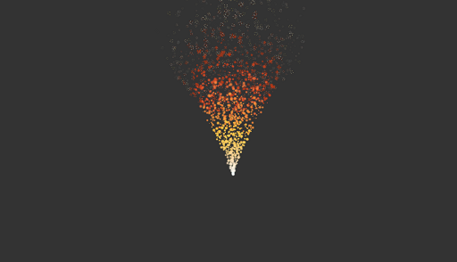

### Toy Engine

In order to gain some expertise on real time rendering techniques and algorithms, as a hobby project I developped this thing.
Not sure how to call it as it's has no true purpose.
I guess playground is the word.

The interface is built with Qt, and the rendering part is done with openGL.

I kind of stopped its development these days because of time constraints.

I'm considering adding support for a vulkan back end when I have some time.

In terms of actual algorithms and techniques, I also have tons of ideas of stuff I want to add.

I also started developping an offline path tracer as part of the software.

The source code is in that repo :
https://github.com/jacquespillet/KikooRenderer

Here are some of the features illustrated with screen grabs.

## Overall Interface

Shot of the interface of the software. The structure of the software is very much influenced by Unity's. 
It is all based on an "Entity Component System" pattern.

Left panel is a scene graph visualisation
Right panel shows the selected object parameters and components.
Bottom panel is a debugging console

## Bloom post process

Quite a simple implementation, lots of room for improvement.

## Depth of field post process

Example of a depth of field with a rather large focus distance.

## Fast approximate Anti aliasing Post process

[Clever algorithm](https://en.wikipedia.org/wiki/Fast_approximate_anti-aliasing) that applies some image processing techniques to reduce jaggered edges due to aliasing.

## Cubemap reflections

## Directional Flow

Implementation of the great tutorial by [Catlike Coding](https://catlikecoding.com/unity/tutorials/flow/directional-flow/).

## Water Plane

The normals and texture coordinates of a plane are displaced using a "dudv" map.
The objects of the scene are reflected onto that plane using the displaced normals.
It also uses the fresnel equations to make the water more reflective based on the camera direction.

## Shadow mapping

The 3 most common types of light are supported :
    * Directional
    * Point
    * Spot
    

* Example of a low resolution shadow map *

* Higher resolution shadow map *

Soft shadows are achieved using either PCF or poisson disk sampling.

## Materials

Several type of materials are built in :
    * Unlit
    * Blinn-phong shading
    * Physically based shading

Lots of room for improvement in that area.

* A few different material parameters *

## Normal maps

Basic implementation of normal mapping

* Simple plane with displaced normals *

## Bump mapping

Basic implementation of bump mapping

  
* On the left is with bump mapping, on the right is without bump mapping *

## Particle system

Simple particle system that uses texture atlases and billboards.

  
* Same Particle system with two differents particle sizes*

## Volumetric ray marching

Tried to implement some ray marching for volumetric to render clouds.
Not 100% satisfied with the result.
It uses a 3d perlin worley noise.

      
    
    

