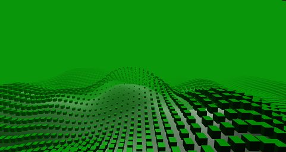
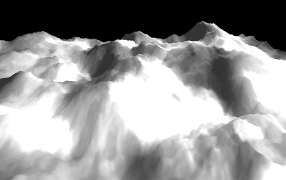
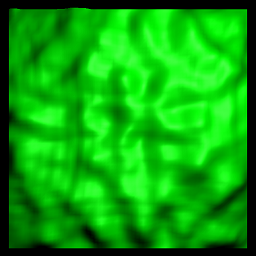
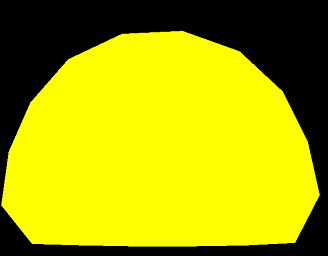
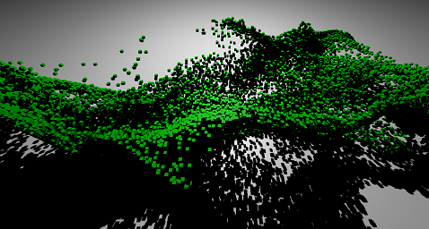

#  ThreeJS Experiments

These are all random micro experiments I've been playing with over the past years in no particular order.

Optimization clearly is not the focus in there, some might take some time to load due to assets.

All the source code is in one of these 2 repositories :
https://github.com/jacquespillet/ThreeJS
https://github.com/jacquespillet/PF_experiments

## [Water surface](Threejs/WaterPlane/index.html)

## [Simple Cell Shading](Threejs/CellShading/CellShading.html)

## [Charcoal Pen](Threejs/Charcoal/Index.html) : 

Attempt to replicate the look of charcoal pen drawings.

## [Noise](Threejs/Flow2D/Index.html)

Just some noise with instanced boxes on top
*Controls on top right*

## [Flow](Threejs/Flow/index.html)

Combination of Fractal Brownian Motion and Gerstner waves.

Resources : 

[Effective Water Simulation from Physical Models](https://developer.nvidia.com/gpugems/gpugems/part-i-natural-effects/chapter-1-effective-water-simulation-physical-models)

[Perlin Noise](https://catlikecoding.com/unity/tutorials/noise/)

*Controls on top right*

## [Fluid surface](Threejs/Fluid/index.html)

Simple fluid simulation over a surface

*Controls on top right*

## [Cloth](Threejs/Cloth/index.html)

## [Hair](Threejs/Hair/Index.html)

Hair simulated with a [position based solver](https://link.springer.com/referenceworkentry/10.1007%2F978-3-319-08234-9_92-1).

The colors are accumulated on the screen.

*Controls on top right*

## [Bubble](Threejs/Bubbles/Index.html)

A 2D soft body simulated with a [position based solver](https://link.springer.com/referenceworkentry/10.1007%2F978-3-319-08234-9_92-1), using simple distance constraints.

Not 100% working.

## [Particles](Threejs/Instances/Index.html)

Just a lot of cubes flowing in the air following the derivatives of a 3d perlin noise.

*Controls on top right*

## [Modifiers](Threejs/Modifiers/index.html)

Experiments on procedurally changing shapes in the vertex shader

## [Cubes](Threejs/Music/Index.html)

A bug in a perlin noise implementation that looks cool.
Be great to make it sound reactive somehow.

*Controls on top right*

## [Volume](Threejs/Volume/Index.html)

Volume ray marching inside a complex mesh ?  Does not really work

## [Flow map](https://jacquespillet.github.io/ThreeJS/scene4.html)

Normal displacement based on a flow map texture, attempt to replicate water flowing.

## [Pastas](https://jacquespillet.github.io/ThreeJS/scene5.html)

## [Particles To Mesh](https://jacquespillet.github.io/ThreeJS/scene6.html)

Very naive approach, every particle is assigned one vertex. On click, each particle moves towards its target position.

## [Machinery](https://jacquespillet.github.io/ThreeJS/scene7.html)

## [Tornado](https://jacquespillet.github.io/ThreeJS/scene12.html)

