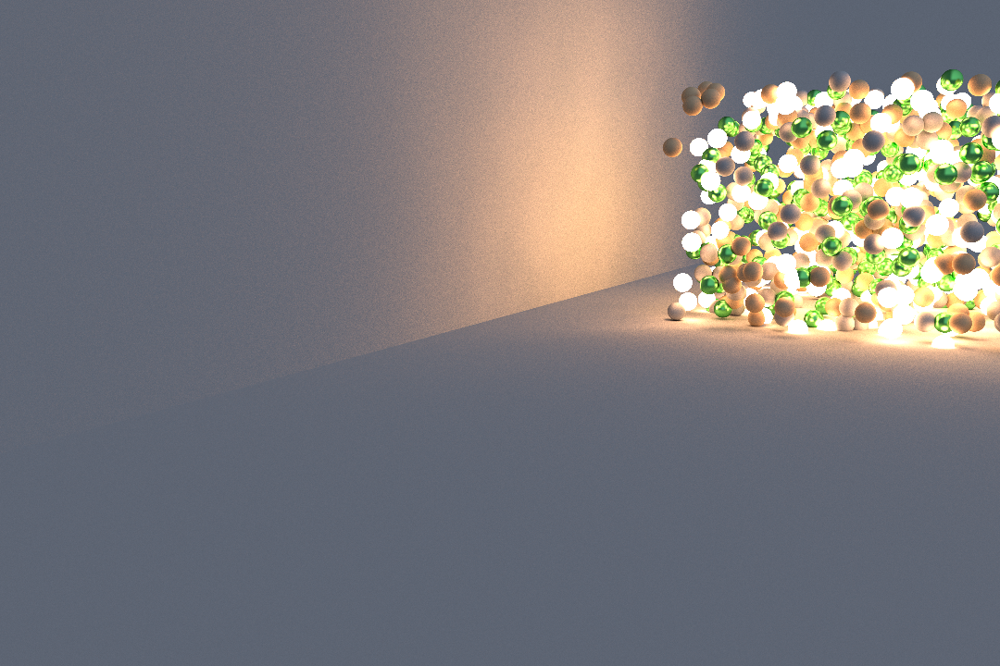
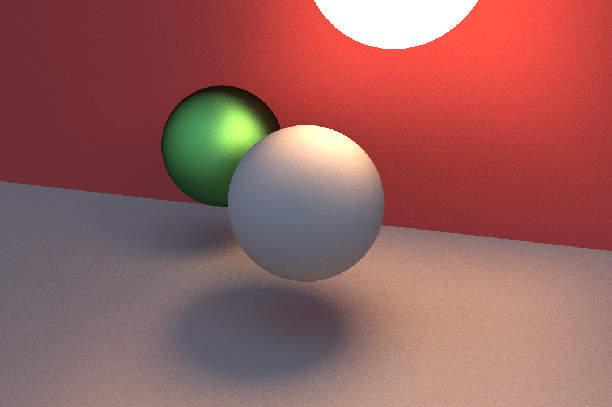

### Path tracing

======

So I first started to write a path tracer while working on my toy engine last year.

Due to time constraints I had to stop developping it.

It was all really based on [Peter Shirley's book series](https://raytracing.github.io/books/RayTracingInOneWeekend.html)

It has some cool features like :

* BRDF Importance sampling
* Triangle mesh loading
* A few different materials (Glossy BRDF, Dielectrics, diffuse)

======

And then this year I wanted to learn SIMD programming so I started writing another path tracer with this idea in mind.

It has more limited features than the previous one for now, but I'm planning adding some more stuff.

At the moment, it can just render spheres, and only has 2 materials (Diffuse and Dielectrics).

It uses a bounding volume hierarchy to accelerate the process.

