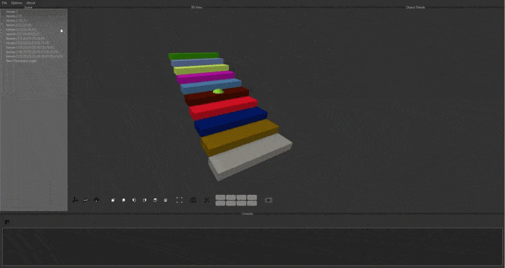

###Physics simulation

Here I showcase some physics simulation I've been playing with in the past years.

##Smoothed particle hydrodynamics

Implementation of SPH, all on the GPU with compute shaders in Unity.

Next step will be to render it properly, I'm thinking implementing [this paper](https://www.cc.gatech.edu/~turk/my_papers/sph_surfaces.pdf)

##Bullets

I've integrated [Bullet physics engine](https://github.com/bulletphysics/bullet3) in my [toy engine](Engine.md).

Here are a few features that I implemented :

###Others

I've started to implement [position based dynamics](https://matthias-research.github.io/pages/publications/posBasedDyn.pdf) in Unity on the GPU.

I've also played a bit with implementing rigid body dynamics on the GPU  using [this paper](https://developer.nvidia.com/gpugems/gpugems3/part-v-physics-simulation/chapter-29-real-time-rigid-body-simulation-gpus)

