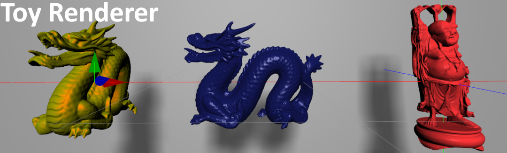
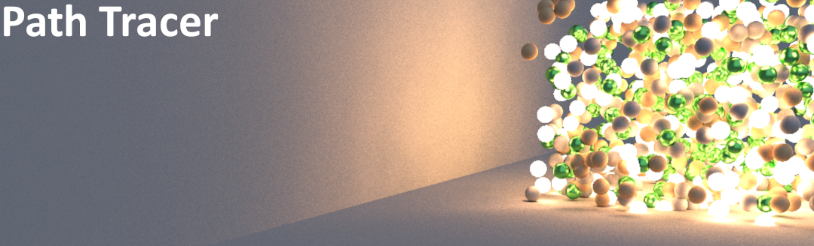

# Hello !

I'm Jacques, a software developper originally from Marseille, France. 

I specialize in designing performant, creative and technically challenging software, mainly for [ScanLAB Projects](https://scanlabprojects.co.uk/), but I’m always keen to explore projects of all kinds.

Here, you'll find a showcase of what I've been up to at ScanLAB, and also some side projects I've been working on in my spare time.

I'm currently available for freelance collaborations.
If you’re looking for help on a project (development, creative tech, or something in between) I’d love to hear from you at jacquespillet5@gmail.com

Thanks for stopping by!

[Linkedin](https://www.linkedin.com/in/jacques-pillet-87bb5697/)

[Resume](https://github.com/jacquespillet/jacquespillet.github.io/raw/main/Resume.pdf)

# ScanLAB Projects

At ScanLAB, I’ve spent the past years building the studio’s technical backbone — leading development of our in-house rendering engine, plus real-time visualization tools, playback/synchronization systems, and production infrastructure.

Below is a look at some of the tools, systems, and creative projects I’ve developed at ScanLAB.

# Recent Projects (Personnal)

Here you'll find my current side projects, brimming with fresh ideas and cutting-edge creativity.

# Older Projects (Personal)

These are some of my older projects that may not be front and center, but still hold a special place for me.

