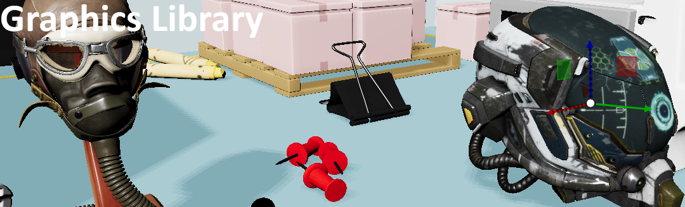

# Hi !

## Welcome to my colorful corner of the internet! 

I'm Jacques, a software developper originally from the beautiful city of Marseille, France. 

My journey took me across the Channel to the bustling creative scene of London, where I honed my craft at [ScanLAB Projects](https://scanlabprojects.co.uk/). 

Now, I'm back in Marseille, but still working for ScanLAB.

Here, you'll find a showcase of what I've been up to on my spare time, a blend of cutting-edge tech and a sprinkle of je ne sais quoi. 

Feel free to explore, get inspired, and drop me a line if you fancy a chat about all things graphics. 

Merci for stopping by and enjoy your stay !

[Linkedin](https://www.linkedin.com/in/jacques-pillet-87bb5697/)

[CV](https://github.com/jacquespillet/jacquespillet.github.io/raw/main/CV%20Jacques.pdf)

# Recent Stuff

Dive into my latest and greatest! Here you'll find my current side projects, brimming with fresh ideas and cutting-edge creativity.

# Older Stuff

A trip down memory lane! This section showcases some of my older projects that may not be front and center, but still hold a special place in my heart.

