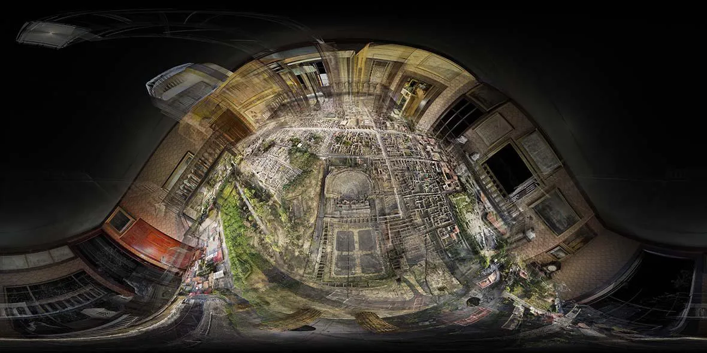

# Renderer

One of my core roles at ScanLAB is designing and maintaining the studio’s in-house rendering engine - the backbone of their entire production pipeline.

This custom engine handles everything from advanced point cloud processing to final rendering, enabling the team to transform raw 3D data into the distinctive visual style that defines ScanLAB’s work.

It empowers artists to build complex 3D environments and produce visually striking point cloud renderings used across films, exhibitions, and installations showcased worldwide.

*© [ScanLAB Projects](https://scanlabprojects.co.uk/).*

The renderer front-end is a node-based editor designed to let users build complex processing and rendering workflows with ease.

With over 200 nodes available, it offers remarkable flexibility and can adapt to virtually any scenario.

The editor can submit processing jobs to a distributed back-end system capable of running across a network of computers and servers.

Workloads are dynamically load-balanced, allowing resources to scale and adapt in real time based on production demands and server availability.

The system integrates cutting-edge point cloud algorithms, ensuring both high rendering performance and efficient data processing.

All the software at ScanLAB is built around a robust CI/CD pipeline with automated unit testing, ensuring reliability and maintainability across the entire codebase.

This setup allows us to deploy updates seamlessly across ScanLAB’s infrastructure, providing the flexibility needed to adapt quickly to the ever-evolving demands of productions and the creative team.

Technologies used : 

c++, python, Qt, OpenGL, OpenCL, OpenCV, PCL, and many more...

Below are some renders and photos of the images rendered by the software. 

*© [ScanLAB Projects](https://scanlabprojects.co.uk/).*

*© [ScanLAB Projects](https://scanlabprojects.co.uk/).*

*© [ScanLAB Projects](https://scanlabprojects.co.uk/).*

*© [ScanLAB Projects](https://scanlabprojects.co.uk/).*

*© [ScanLAB Projects](https://scanlabprojects.co.uk/).*

*© [ScanLAB Projects](https://scanlabprojects.co.uk/).*

*© [ScanLAB Projects](https://scanlabprojects.co.uk/).*

*© [ScanLAB Projects](https://scanlabprojects.co.uk/).*

*© [ScanLAB Projects](https://scanlabprojects.co.uk/).*

*© [ScanLAB Projects](https://scanlabprojects.co.uk/).*

*© [ScanLAB Projects](https://scanlabprojects.co.uk/).*
