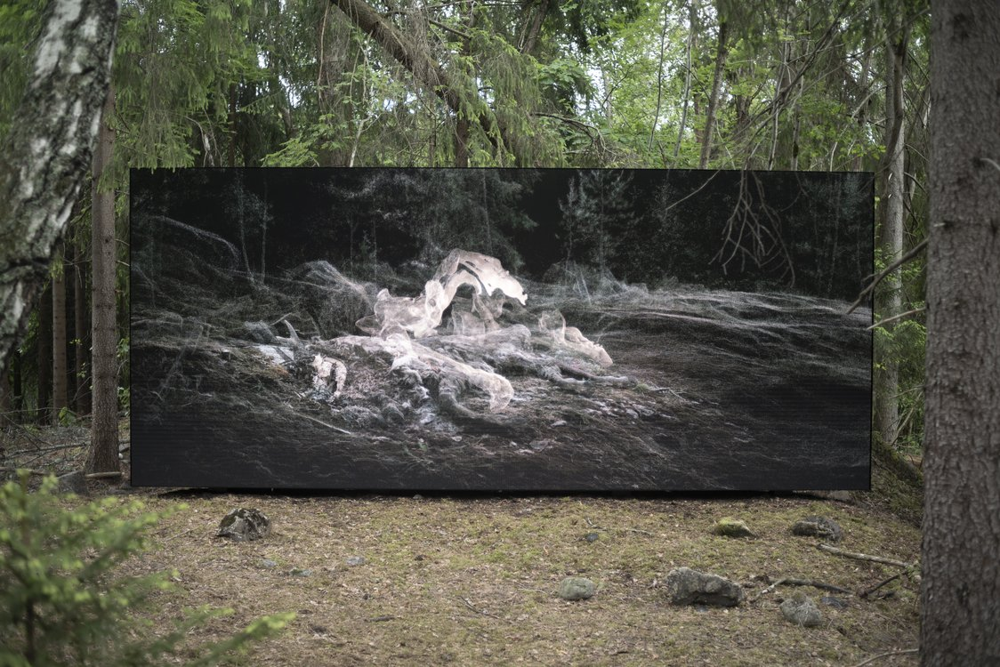

# Variants

ScanLAB was commissioned by French artist Pierre Huyghe to contribute to Variants, a large-scale multidisciplinary project that included a screen-based installation.

My role was to develop a real-time point cloud rendering system capable of displaying data ranging from the vast scale of an entire island down to the microscopic detail of pine needles - all rendered with the distinct visual quality characteristic of ScanLAB’s work.

The resulting visuals were presented on a 10-meter-wide outdoor LED screen, delivering an immersive experience that blended art and technology.

This project was developed in close collaboration with Pierre Huyghe’s technical teams.

Technologies: Unity, C#, HLSL shaders

*© Pierre Huyghe*

Links : 

[Kistefos Museum](https://www.kistefosmuseum.com/sculptur/variants)

[artisalive](https://artisalive.co.uk/2022/07/10/pierre-huyghe-variants-at-kistefos-museum/)

[hauserwirth](https://www.hauserwirth.com/news/36415-pierre-huyghe-to-create-site-specific-work-second-law-at-kistefos-in-norway/)

[crousel](https://www.hauserwirth.com/news/36415-pierre-huyghe-to-create-site-specific-work-second-law-at-kistefos-in-norway/)

