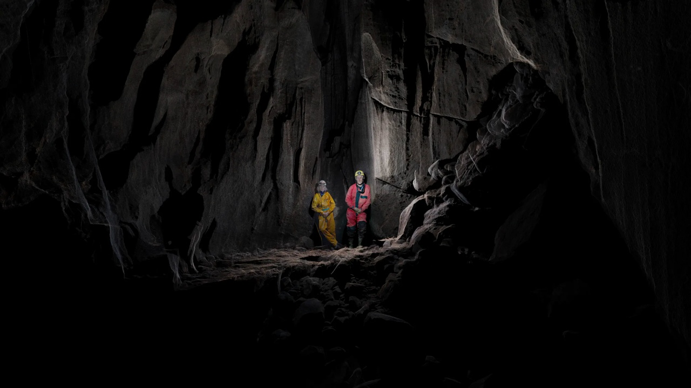

# XR

ScanLAB explores the use of point clouds as a creative medium for XR experiences.

My role was to design and implement a rendering framework optimized for various target platforms, enabling real-time point cloud rendering while maintaining ScanLAB’s signature aesthetic.

I also contributed directly to the development of the immersive pieces, collaborating closely with artists and directors.

Technonolgies : Unity, c#, hlsl

Key Projects:

Eternal Return - A collaboration between ScanLAB Projects and Swedish artist duo Lundahl & Seitl.

Focused on the rendering backend for HTC Vive devices.

Built a high-quality real-time rendering system tailored for large-scale point cloud environments.

This piece was shown in major international venues, such as BFI London Film Festival, SXSW, CPH:DOX, and more.

*© [ScanLAB Projects](https://scanlabprojects.co.uk/).*

Links : 

[ScanLAB Projects](https://scanlabprojects.co.uk/projects/eternal-return/)

[Lundahl & Seitl](https://lundahl-seitl.minerva2.vscmedia.com/work/eternal-return)

Buried in the Rocks - Described by ScanLAB as “a novel form of VR documentary: a portrait of a place and the people that know it best.”

Developed a new rendering pipeline for Oculus Quest 1 & 2, optimized for mobile GPUs.

Balanced performance and visual fidelity for immersive, real-time point cloud rendering on standalone VR hardware.

*© [ScanLAB Projects](https://scanlabprojects.co.uk/).*

Links : 

[ScanLAB Projects](https://scanlabprojects.co.uk/projects/buried-in-the-rock/)

