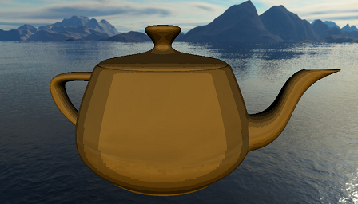
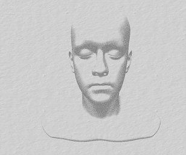
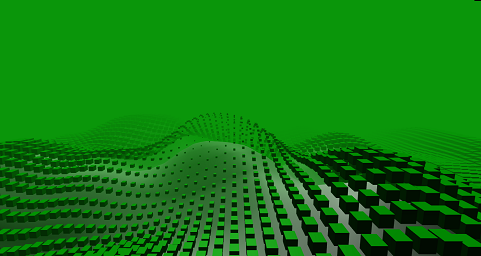
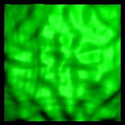
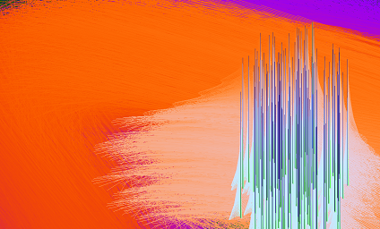
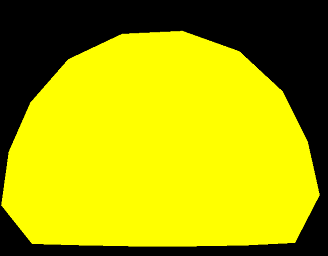
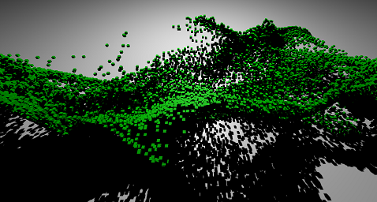
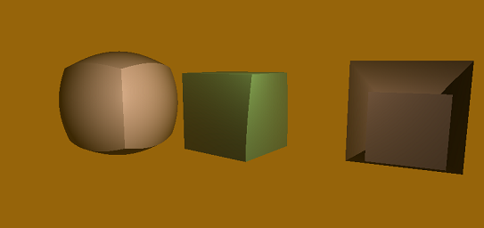

###  ThreeJS Experiments

These are all random micro experiments I've been playing with over the past years in no particular order.

Nothing is optimized in there, some might take some time to load due to assets.

## [Simple Cell Shading](Threejs/CellShading/CellShading.html)

## [Charcoal Pen](Threejs/Charcoal/Index.html) : 

Attempt to recreate the look of charcoal pen drawings.

## [Noise](Threejs/Flow2D/Index.html)

Just some noise with instanced boxes on top

*Controls on top right*

## [Flow](Threejs/Flow/index.html)

Combination of Fractal Brownian Motion and Gerstner waves.

Resources : 

[Effective Water Simulation from Physical Models](https://developer.nvidia.com/gpugems/gpugems/part-i-natural-effects/chapter-1-effective-water-simulation-physical-models)

[Perlin Noise](https://catlikecoding.com/unity/tutorials/noise/)

*Controls on top right*

## [Fluid surface](Threejs/Fluid/index.html)

Simple fluid simulation over a surface

*Controls on top right*

## [Cloth](Threejs/Cloth/index.html)

## [Hair](Threejs/Hair/Index.html)

Hair simulated with a [position based solver](https://link.springer.com/referenceworkentry/10.1007%2F978-3-319-08234-9_92-1).

The colors are accumulated on the screen.

*Controls on top right*

## [Hair](Threejs/Bubbles/Index.html)

A 2D soft body simulated with a [position based solver](https://link.springer.com/referenceworkentry/10.1007%2F978-3-319-08234-9_92-1), using simple distance constraints.

Not 100% working.

## [Particles](Threejs/Instances/Index.html)

Just a lot of cubes flowing in the air following the derivatives of a 3d perlin noise.

*Controls on top right*

## [Modifiers](Threejs/Modifiers/index.html)

Experiments on procedurally changing shapes in the vertex shader

## [Cubes](Threejs/Music/Index.html)

A bug in a perlin noise implementation that looks cool.
Be great to make it sound reactive somehow.

*Controls on top right*

## [Volume](Threejs/Volume/Index.html)

Volume ray marching inside a complex mesh ?  Does not really work
