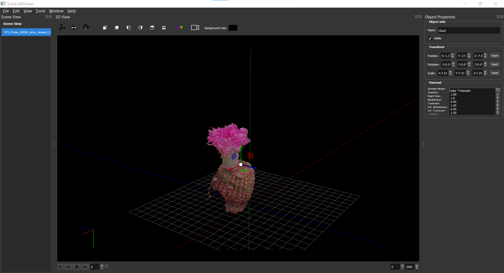

I also developed a custom 3D viewer for ScanLAB — a lightweight yet powerful tool designed to visualize and manipulate ScanLAB’s proprietary file formats, as well as standard 3D assets such as .obj, .fbx, or .gltf. It also supports animated file formats, allowing users to preview and work with time-based 3D data directly within the viewer.

It enables users to draft and edit complex 3D scenes with ease: moving objects, adjusting materials, editing point clouds (noise removal, resampling, etc.), and organizing elements within a scene-graph hierarchy similar to modern game engines.

The viewer also includes a camera animation system for creating dynamic camera moves, and an integrated renderer capable of producing high-resolution stills using either CPU or GPU rendering backends.

Technologies : c++, Qt, OpenGL

*© [ScanLAB Projects](https://scanlabprojects.co.uk/).*